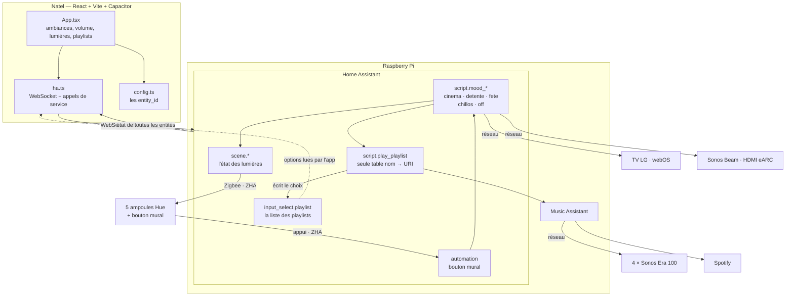
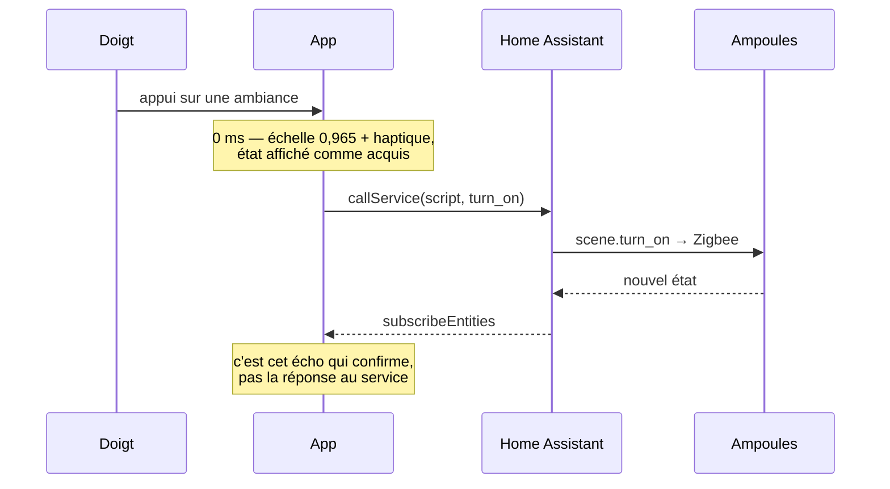
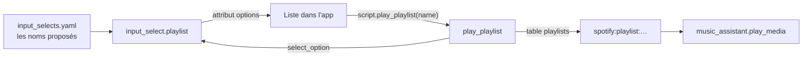

# Architecture

Tout ce que fait cette installation, et où chaque chose tourne.

## Le système entier



## Le trajet d'un appui

L'app n'attend jamais le Pi pour répondre. Elle répond, puis se fait confirmer.



Si l'écho n'arrive pas, l'affichage revient à son état précédent **en nommant
l'entité** qui n'a pas répondu, jamais par un message anonyme.

## Les playlists

La liste ne vit pas dans le build de l'app. Le jeton d'accès y étant embarqué,
y toucher voudrait dire reconstruire l'app et la réinstaller sur le natel à
chaque playlist ajoutée.



`script.play_playlist` est **la seule table nom → URI du dépôt**. Les ambiances
l'appellent au lieu de porter chacune leur adresse, il refuse un nom absent de
la table plutôt que d'envoyer un `media_id` vide, et il écrit le choix dans le
helper — c'est cette écriture, revenue par le WebSocket, qui allume le bouton
dans l'app.

Ajouter une playlist, c'est donc **deux lignes sur le Pi et aucun rebuild** :
son URI dans la table de `scripts.yaml`, son nom dans `input_selects.yaml`.
N'ajouter un nom que lorsque son URI est renseignée : une entrée sans adresse
serait un bouton qui ne joue rien.

`radio_mode` est un paramètre du script, pas une décision du script. Détente
le passe à `true` — la playlist sert de graine et la lecture part ailleurs
après quelques titres. Chillos ne le passe pas, donc sa playlist se joue telle
quelle.

## Les entity_id à renseigner

| Rôle | entity_id | État |
|---|---|---|
| Lumière salon | `light.salon` | liée |
| Lumière cuisine | `light.cuisine` | liée |
| Lumière chambre | `light.chambre` | liée |
| TV | `media_player.lg_tv` | liée |
| Barre (Sonos) | `media_player.sonos_beam` | liée |
| Salon (Music Assistant) | `media_player.ma_salon` | liée |
| Cuisine (Music Assistant) | `media_player.ma_cuisine` | liée |
| Chambre (Music Assistant) | `media_player.ma_chambre` | à vérifier |
| Bouton mural (ZHA) | `device_id` dans `automations.yaml` | **gabarit** |
| Playlist Chillos | table de `script.play_playlist` | définie |
| Ambiance Fête | `script.mood_fete` | **n'existe pas** |

Les vrais noms sont dans Paramètres → Appareils et services → Entités.

## Tester sans Raspberry Pi

Home Assistant et Music Assistant tournent aussi bien dans deux conteneurs sur
un portable. `dev/configuration.yaml` inclut les fichiers du dépôt et ajoute
trois fausses ampoules, de sorte que `light.salon` existe sans qu'aucune
ampoule soit branchée, et `dev/music/` sert de bibliothèque locale pour
entendre quelque chose sans compte Spotify.

```bash
docker compose -f docker-compose.dev.yml up
```

La procédure complète, avec à chaque couche la commande qui prouve qu'elle
marche, est dans [TESTING.md](TESTING.md) — elle n'est pas répétée ici, pour
qu'il n'y ait qu'un endroit à tenir à jour.

Le dépôt n'est jamais écrit par Home Assistant : `homeassistant/` est monté en
lecture seule sur `/config/casa`, et la base, les journaux et les secrets vont
dans un volume Docker.

## Ce qui tourne où

| | Raspberry Pi | Natel | Poste de dev |
|---|---|---|---|
| Home Assistant | ✓ | | ✓ (conteneur) |
| Music Assistant | ✓ | | ✓ (conteneur) |
| L'app | | ✓ | ✓ (`npm run dev`) |
| Le jeton d'accès | | dans le build | dans `.env` |

Le jeton de longue durée est embarqué dans le build de l'app : l'`.apk` et
l'`.ipa` le contiennent en clair. L'app reste privée et ne se distribue pas.
