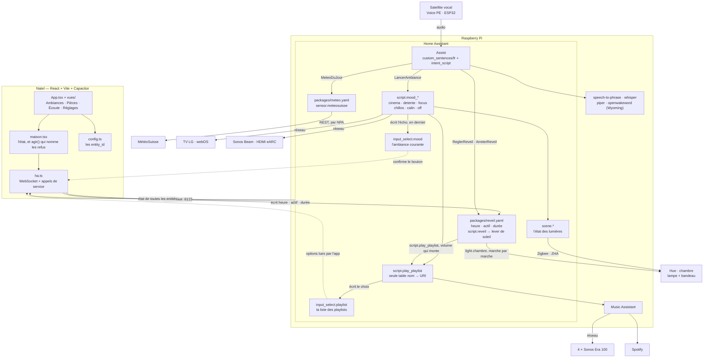
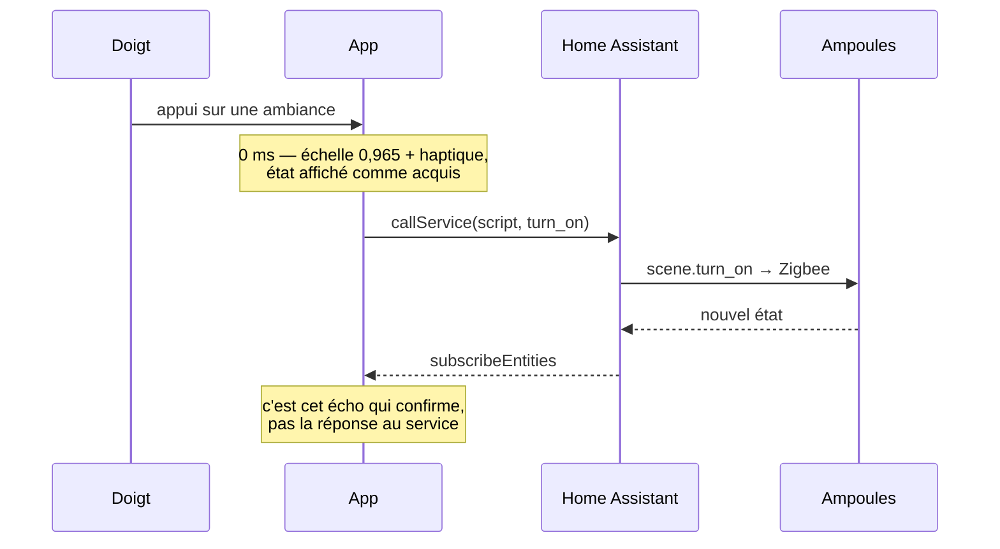
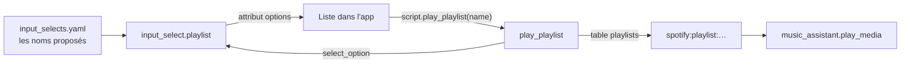
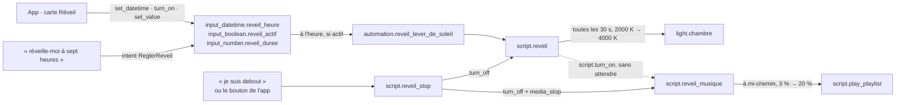

# Architecture

Tout ce que fait cette installation, et où chaque chose tourne.

> **Ce document décrit la maison visée. Le dépôt, lui, ne pilote aujourd'hui
> qu'une pièce : la chambre.** Une ampoule `light.chambre`, une enceinte
> `media_player.ma_chambre`, cinq ambiances. Les schémas et les tableaux qui
> suivent gardent le salon, la cuisine, la TV et les Sonos parce que c'est là
> qu'on va — mais les entités correspondantes ne sont plus référencées par le
> code. Voir « Une seule pièce, la chambre » dans [TESTING.md](TESTING.md), et
> l'historique git au commit `ccb9f08` pour la version multi-pièces.

## Le système entier



## Le trajet d'un appui

L'app n'attend jamais le Pi pour répondre. Elle répond, puis se fait confirmer.



Si l'écho n'arrive pas, l'affichage revient à son état précédent **en nommant
l'entité** qui n'a pas répondu, jamais par un message anonyme.

Pour une lumière ou une playlist, l'écho est l'état de l'entité elle-même.
Pour une ambiance, rien ne le porte naturellement — un script s'exécute et
retombe à `off` — d'où `input_select.mood`, que chaque `script.mood_*` écrit
**en dernière étape** avec son propre `entity_id`. En dernière, donc absent si
une étape a échoué : une ambiance dont le son n'est pas parti ne se confirme
pas, et l'app le dit au bout de six secondes plutôt que de laisser le bouton
allumé. Un refus immédiat de Home Assistant fait la même chose sans attendre.

La perte du Pi se dit aussi : la librairie se reconnecte seule, et l'app écoute
`disconnected` / `ready` pour passer le point à l'ambre en nommant l'hôte, puis
le remettre au vert.

## Les playlists

La liste ne vit pas dans le build de l'app. Le jeton d'accès y étant embarqué,
y toucher voudrait dire reconstruire l'app et la réinstaller sur le natel à
chaque playlist ajoutée.



`script.play_playlist` est **la seule table nom → URI du dépôt**. Les ambiances
l'appellent au lieu de porter chacune leur adresse, il refuse un nom absent de
la table plutôt que d'envoyer un `media_id` vide, et il écrit le choix dans le
helper — c'est cette écriture, revenue par le WebSocket, qui allume le bouton
dans l'app.

Ajouter une playlist, c'est donc **deux lignes sur le Pi et aucun rebuild** :
son URI dans la table de `scripts.yaml`, son nom dans `input_selects.yaml`.
N'ajouter un nom que lorsque son URI est renseignée : une entrée sans adresse
serait un bouton qui ne joue rien.

`name` accepte aussi une adresse, jouée telle quelle : une URI Spotify, le
lien de partage de Spotify, ou `library://playlist/83` de Music Assistant.
Une valeur qui n'est ni un nom de la table ni une adresse fait échouer le
script, au lieu de ne rien jouer en silence.

**La musique de chaque ambiance se règle dans Home Assistant**, pas dans le
dépôt : `input_text.musique_detente`, `_focus`, `_chillos`, `_calin`
(`packages/ambiances.yaml`), à modifier dans Paramètres → Entrées. Vide,
l'ambiance joue son `defaut` de `scripts.yaml` ; `aucune`, elle laisse la
musique telle quelle. C'est le même partage que pour les scènes : ce qu'on
joue est du goût et se change sans commit, l'ordre des étapes et l'écho
restent de la logique, dans git.

`radio_mode` est un paramètre du script, pas une décision du script. Détente
le passe à `true` pour sa playlist par défaut — elle sert de graine et la
lecture part ailleurs après quelques titres. Une playlist choisie dans le
réglage d'une ambiance se joue toujours telle quelle.

## Le réveil

Tout le réveil tient dans `homeassistant/packages/reveil.yaml` — un *package*
Home Assistant, fusionné avec le reste par la clé `packages:` des deux
`configuration.yaml`. Ses réglages sont trois helpers, parce que l'app les
écrit depuis le natel et que le Pi les garde au redémarrage ; le YAML ne porte
que des valeurs par défaut.



La musique n'est **pas** dans `script.reveil`. Il la confie à
`script.reveil_musique` par un `script.turn_on`, qui rend la main tout de suite
et dont les erreurs ne remontent pas. C'est l'inverse des ambiances, où le son
qui échoue empêche l'écho — et c'est voulu : une ambiance ratée se voit sur
le natel, un réveil raté fait rater le train. Sans enceinte, la lumière se
lève quand même.

L'écho côté app est l'état des helpers eux-mêmes, et `script.reveil` qui
reste `on` tant que le jour se lève : c'est lui qui transforme « Essai d'une
minute » en « Je suis debout ».

## La voix

Quatre services Wyoming dans le compose — whisper et speech-to-phrase
(reconnaissance), piper (synthèse), openwakeword (mot d'appel) — que seul
Home Assistant joint, par leur nom de service. Un satellite ne parle qu'à
Home Assistant.

Deux moteurs de reconnaissance pour deux machines. Whisper transcrit tout et
demande un vrai processeur. Speech-to-Phrase ne transcrit que les phrases
qu'on lui a apprises, et tient en moins d'une seconde sur un Pi : c'est lui
sur le Pi. Il lit `custom_sentences/` dans le même format que Home
Assistant, donc une phrase s'écrit une seule fois, au même endroit, pour
être entendue et comprise.

Les phrases du dépôt sont dans `homeassistant/custom_sentences/fr/`, un
fichier par sujet, et chacune nomme un intent que `intent_script` traite dans
le package du même sujet. Une phrase, c'est donc deux lignes : la tournure,
et ce qu'elle déclenche. Les listes `range` comprennent les nombres en toutes
lettres — « sept heures trente » donne `heure=7`, `minutes=30`.

`custom_sentences/` a une place imposée : directement sous `/config`. En dev,
le compose l'y monte à part, puisque le reste du dépôt vit sous `/config/casa`.

## La météo

`packages/meteo.yaml` : un capteur REST sur l'API que l'app MétéoSuisse
utilise elle-même, par NPA (`input_text.meteo_npa`), toutes les trente
minutes. `sensor.meteosuisse` porte la température actuelle et six jours de
prévisions en attributs ; l'intent `MeteoDuJour` choisit le jour d'aujourd'hui
par sa date et compose la phrase. API non documentée : si elle change, Assist
le dit (« je n'ai pas les prévisions ») plutôt que de se tromper.

## Les entity_id à renseigner

| Rôle | entity_id | État |
|---|---|---|
| Lumière salon | `light.salon` | liée |
| Lumière cuisine | `light.cuisine` | liée |
| Lumière chambre | `light.chambre` | liée |
| TV | `media_player.lg_tv` | liée |
| Barre (Sonos) | `media_player.sonos_beam` | liée |
| Salon (Music Assistant) | `media_player.ma_salon` | liée |
| Cuisine (Music Assistant) | `media_player.ma_cuisine` | liée |
| Chambre (Music Assistant) | `media_player.ma_chambre` | à vérifier |
| Ambiance courante | `input_select.mood` | définie (`input_selects.yaml`) |
| Réveil : heure, actif, durée | `input_datetime.reveil_heure`, `input_boolean.reveil_actif`, `input_number.reveil_duree` | définis (`packages/reveil.yaml`) |
| Lever de soleil | `script.reveil`, `script.reveil_musique`, `script.reveil_stop` | définis (`packages/reveil.yaml`) |
| NPA MétéoSuisse | `input_text.meteo_npa` | 1700 par défaut, **à changer** |
| Capteur de la pièce (Sonoff SNZB-02P, ZHA) | `sensor.temperature_interieure`, `sensor.humidite_interieure` | simulés en dev, **à renommer** sur le Pi |
| Voix : speech-to-phrase, whisper, piper, openwakeword | intégration Wyoming Protocol, par l'interface | à lier (TESTING.md 1.9) |
| Clé Zigbee | vue seule sous Home Assistant OS ; `ZIGBEE_DEVICE` de `app/.env` sous Docker | branchée sur le Pi |
| Playlist Chillos | table de `script.play_playlist` | définie |

Les vrais noms sont dans Paramètres → Appareils et services → Entités.

## Tester sans Raspberry Pi

Home Assistant et Music Assistant tournent aussi bien dans deux conteneurs sur
un portable. `dev/configuration.yaml` inclut les fichiers du dépôt et ajoute
deux fausses ampoules, de sorte que `light.chambre` et `light.chambre_bandeau` existent sans qu'aucune
ampoule soit branchée, et `dev/music/` sert de bibliothèque locale pour
entendre quelque chose sans compte Spotify.

```bash
docker compose -f docker-compose.dev.yml up
```

La procédure complète, avec à chaque couche la commande qui prouve qu'elle
marche, est dans [TESTING.md](TESTING.md) — elle n'est pas répétée ici, pour
qu'il n'y ait qu'un endroit à tenir à jour.

Le dépôt n'est jamais écrit par Home Assistant : `homeassistant/` est monté en
lecture seule sur `/config/casa`, et la base, les journaux et les secrets vont
dans un volume Docker.

## Ce qui tourne où

| | Raspberry Pi | Natel | Poste de dev |
|---|---|---|---|
| Home Assistant | ✓ | | ✓ (conteneur) |
| Music Assistant | ✓ | | ✓ (conteneur) |
| L'app | | ✓ | ✓ (`npm run dev`) |
| Le jeton d'accès | | dans le build | dans `.env` |

Le jeton de longue durée est embarqué dans le build de l'app : l'`.apk` et
l'`.ipa` le contiennent en clair. L'app reste privée et ne se distribue pas.
